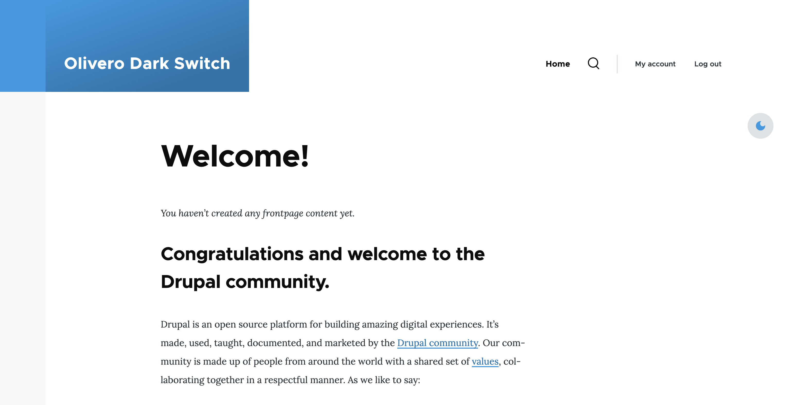
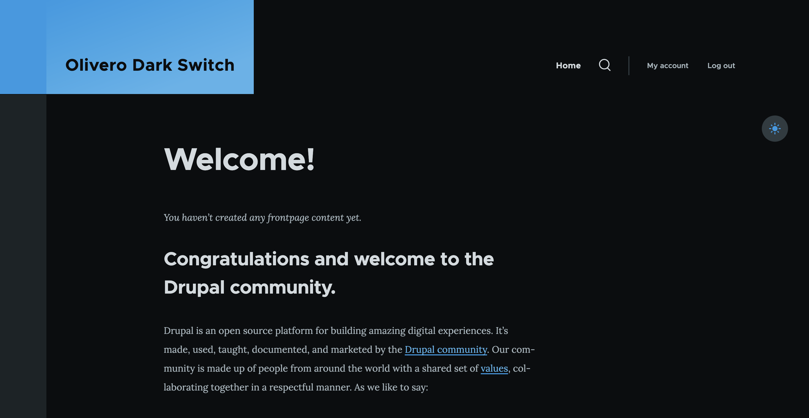
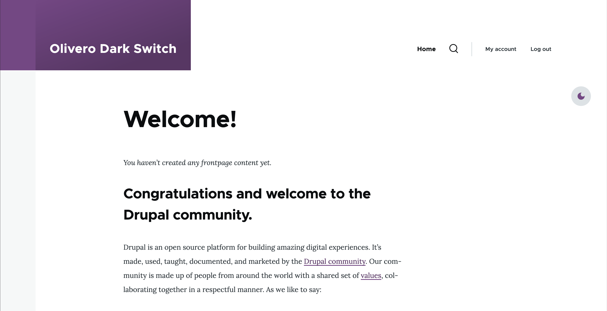
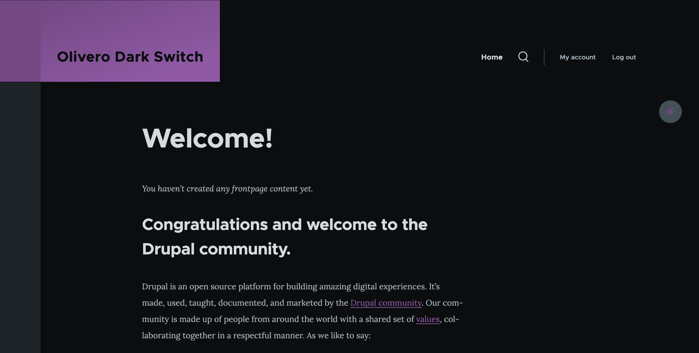
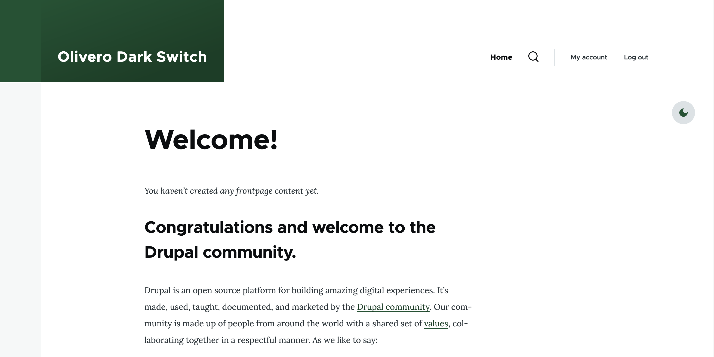
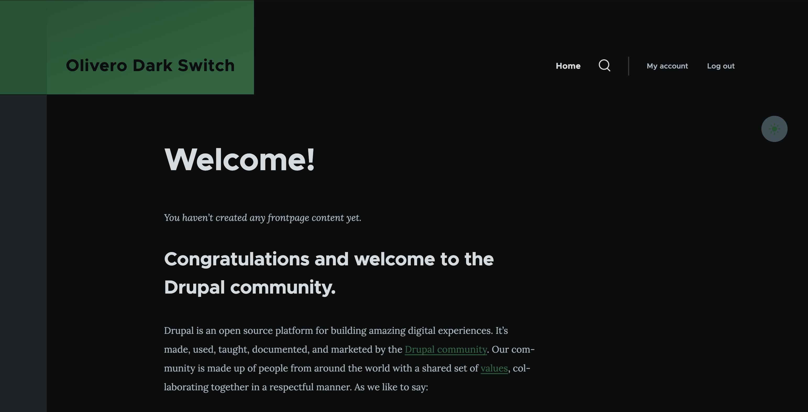

# Olivero Dark Switch

This module will provide a dark switch toggle for the Olivero theme and associated CSS to make this work.

## How to use this module

1. First install this module using composer.
2. Next place the "Olivero Dark Switch" block in the "Highlighted" region and set the float option to "Right".
3. Now when you load the main site, there will be a dark theme toggle button.

## Screenshots

The following screenshots show this module in action on Drupal 11 where it was configured as mentioned above.

| Light                                                                          | Dark                                                                         |
| :----------------------------------------------------------------------------: | :--------------------------------------------------------------------------: |
|  |  |
|  |  |
|  |  |

## Development

You can either run a container directly as shown below OR USE VSCODE DEVCONTAINER.
```
docker run --publish=9000:80 --name=darkswitch -tid --volume=$(pwd):/var/www/drupal/web/modules/contrib/olivero_dark_switch tripalproject/tripaldocker:latest
```
